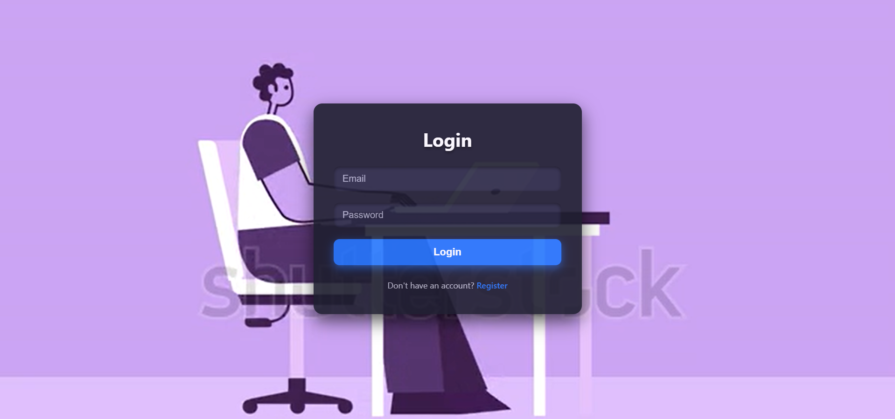

# 🛡 Secure Notes App

A *full-stack web application* to securely create, store, and manage your personal notes — accessible anytime, anywhere.  
This is my *first full stack project*, built while learning end-to-end web development.

## 🚀 Tech Stack
- *Frontend:* HTML, CSS, JavaScript  
- *Backend:* Node.js, Express.js  
- *Database:* MongoDB  
- *Others:* REST API, bcrypt for password hashing, JWT for authentication

## ✨ Features
- 🔐 *User Authentication* (Sign up, Login, Logout)
- 🗝 *Password Encryption* using bcrypt
- 📝 *Create, Read, Update, Delete* notes
- 📂 Notes linked to specific user accounts
- 🌐 Responsive design for different devices

## 📦 Installation & Setup
1. *Clone the repository*
   ```bash
   git clone https://github.com/<your-username>/<your-repo-name>.git
   cd <your-repo-name>

##📁Folder Structure 

Secure Notes App/
 ├── config/
 │    └── db.js           # Database connection
 ├── controllers/
 │    ├── authController.js
 │    └── notesController.js
 ├── models/
 │    ├── User.js
 │    └── Note.js
 ├── routes/
 │    ├── auth.js
 │    └── notes.js
 ├── public/              # Frontend (HTML, CSS, JS)
 ├── server.js            # Entry point
 ├── package.json
 └── README.md

## 📸 Screenshots

  
Register Page

  
Login Page

  
Notes Dashboard

---

## 👨‍💻 Author

*Yash Kumar Singh*  
-🎓B.Tech Chemical Engineering (2024–2028)  
-🏫NIT Durgapur    
- GitHub: [@coder40425](https://github.com/coder40425)  
- LinkedIn: [Yash Kumar Singh](https://www.linkedin.com/in/yash-kumar-singh-18843232a)

---

Feel free to check out the code and suggest improvements!  
Happy coding! 😊
