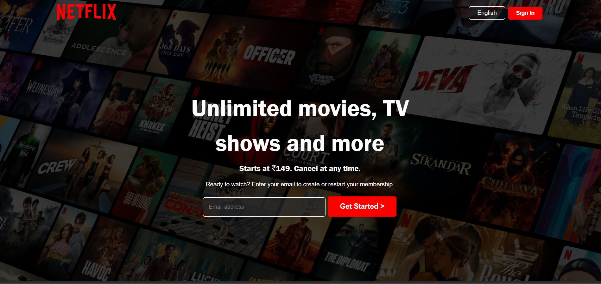

# 🎬 Netflix Clone

This is a *Netflix homepage clone* built purely with *HTML and CSS*.

---

## 🚀 Features

- Pixel-perfect layout inspired by Netflix’s homepage
- Responsive design (work in progress)
- Uses Flexbox and CSS Grid for layout
- Custom fonts and icons used to replicate original feel

---

## 🛠 Technologies Used

- HTML5
- CSS3 (Flexbox, Grid)
- Google Fonts / Custom fonts
- Images and icons stored in the assets/ folder

---
---

## ⚠ Note

Responsiveness is currently a work in progress. I’m actively improving the design to work seamlessly on all device sizes.

---

## 📸 Screenshots

---

## 📫 Connect with Me

- GitHub: [@coder40425](https://github.com/coder40425)  
- LinkedIn: [Yash Kumar Singh](https://www.linkedin.com/in/yash-kumar-singh-18843232a)

---

Feel free to check out the code and suggest improvements!  
Happy coding! 😊
