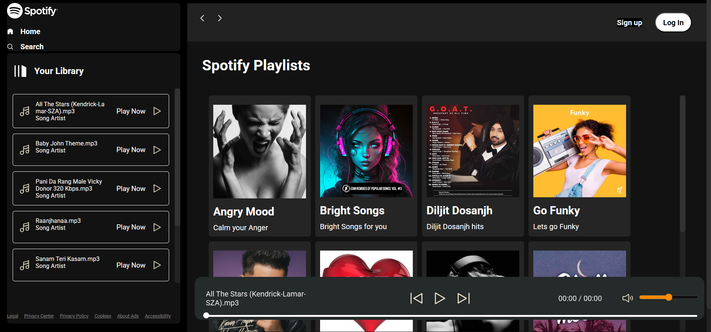
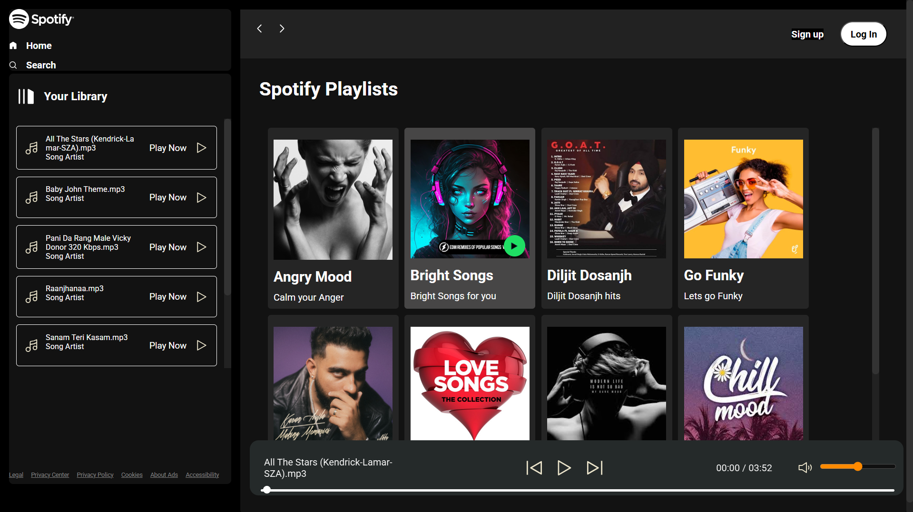
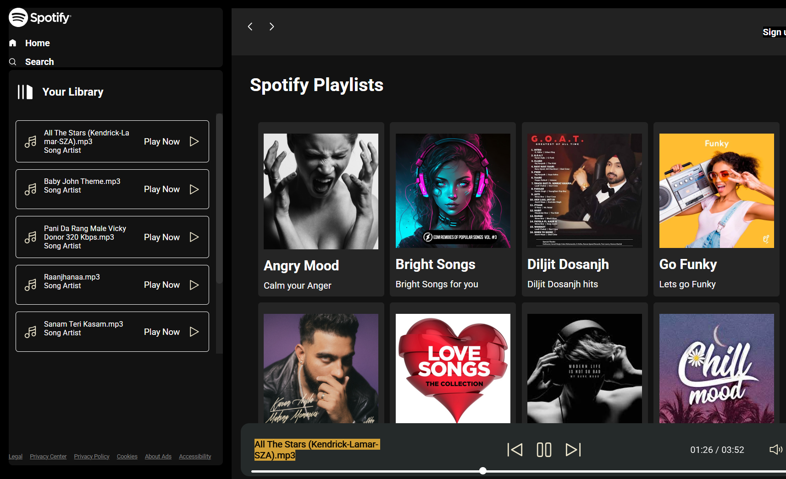
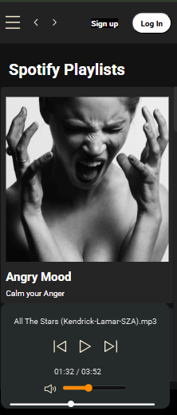
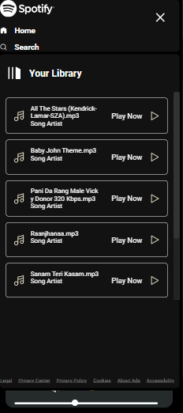

# 🎵 Spotify Clone - Music Player Web App

---

A fully responsive music player web app that mimics Spotify's interface and basic functionality — built using *HTML, **CSS, and **JavaScript* (Vanilla JS).

## 🚀 Features

- 🎧 Play/Pause songs
- 🧭 Seek bar with live progress
- ⏮ Next/Previous song controls
- 📂 Folder-based dynamic song loading
- 🔊 Volume control
- 🎵 Dynamic playlist generation
- 📱 Fully responsive for all screen sizes
- 🔁 Album switching via card UI
- ⚙ Clean UI with DOM manipulation and event handling

> Make sure to run this on a local server (e.g., using *Live Server* in VS Code) or set up a basic Node/Express static server since fetch() won’t work properly via file://.

---

## 🧠 Tech Stack

- *HTML5* – Structure
- *CSS3* – Styling (Fully responsive)
- *JavaScript (ES6+)* – Logic & interactivity (DOM, async/await, event handling)

---

## 📦 How to Use

1. Clone the repo:
   ```bash
   git clone https://github.com/yourusername/spotify-clone.git

---

## 📸 Screenshots

### 🎛 Main UI



### 📂 Album Card Click



### 🎵 Song Playing with Seekbar



---

## 📱 Mobile View

### 📸 Screenshot 1 – Mobile Home UI             

               

 ### 📸 Screenshot 2 – Mobile Playlist

 


---

## 👨‍💻 Author

*Yash Kumar Singh*  
-🎓B.Tech Chemical Engineering (2024–2028)  
-🏫NIT Durgapur    
- GitHub: [@coder40425](https://github.com/coder40425)  
- LinkedIn: [Yash Kumar Singh](https://www.linkedin.com/in/yash-kumar-singh-18843232a)

---

Feel free to check out the code and suggest improvements!  
Happy coding! 😊
